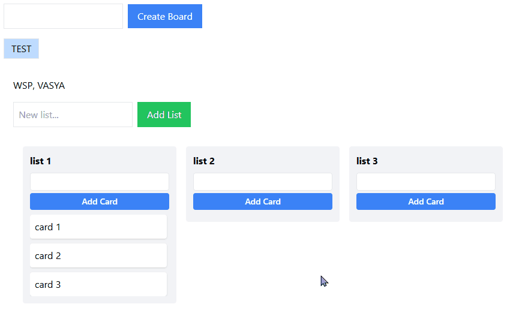

# Kanban — Frontend

Client-side of a Kanban application: boards, lists, and cards with smooth drag-and-drop and optimistic UI updates.

**Live app:** [deployment link]
**Backend repository:** [[backend repo link](https://github.com/arssenpy/kanban-backend)]



## Tech Stack

- **Next.js** (App Router) + **TypeScript**
- **TanStack Query (React Query)** — server state, caching, optimistic updates
- **@dnd-kit** — drag-and-drop for lists and cards
- **Zustand** — lightweight client state (auth)
- **Axios** — HTTP client with a JWT interceptor
- **Sonner** — toast notifications
- **Feature-Sliced Design (simplified)** — `entities / features / widgets / shared`

## Architectural Decisions

- **Feature-Sliced-like structure**: `entities` hold pure data logic (types, API calls, React Query hooks) with no UI logic; `widgets` assemble these entities into ready UI blocks; `features` encapsulate self-contained interactive behavior (drag-and-drop) independent of any specific widget.
- **Optimistic UI for drag-and-drop**: the new order of cards/lists is written to the React Query cache synchronously, before the network request — this removes the lag and "flicker" during dragging. On a server error, an exact rollback restores the previous state from a snapshot taken right before the write.
- **A single axios instance with an interceptor**: the auth token is attached to every request automatically; a 401 response centrally clears the session, avoiding duplicated logic across hooks.
- **Toast notifications tied to mutation `onError`/`onSuccess`**, rather than scattered across components — a single source of truth for UX feedback.

## Project Structure

```
src
├── app/                # Next.js App Router: layout, providers, page
├── entities/            # board / card / list / auth — types, API, hooks
├── features/            # drag-card
├── shared/
│   ├── api/             # axios instance, query keys
│   └── lib/              # utilities (token storage, error parsing)
└── widgets/             # board-view, list-column, card-item, auth
```

## Running Locally

### Prerequisites

- Node.js 18+
- The backend running (see the backend repository) at `http://localhost:5000`

### Steps

```bash
git clone <frontend-repo-url>
cd <frontend-repo-folder>
npm install
```

Create `.env.local` based on `.env.example`:

```
NEXT_PUBLIC_API_URL=http://localhost:5000
```

Run:

```bash
npm run dev
```

The app will be available at `http://localhost:3000`.

## Core Features

- Registration / login (JWT, token stored in `localStorage`)
- Creating boards, lists, and cards
- Drag-and-drop reordering of lists and cards (within a list and across lists) with optimistic UI updates
- Toast notifications for success/error feedback
- Data isolation — each user only sees their own boards
